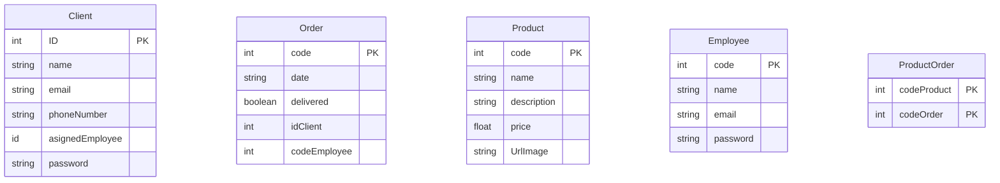

# TeckEume's Database

## Entity-relationship diagram

## Database tables

```mermaid
erDiagram
  Client {
    int ID PK
    string name
    string email
    string phoneNumber
    id asignedEmployee
    string password
  }
  Order {
    int code PK
    string date
    boolean delivered
    int idClient
    int codeEmployee
  }
  Product {
    int code PK
    string name
    string description
    float price
    string UrlImage
  }
  Employee {
    int code PK
    string name
    string email
    string password
  }
  ProductOrder {
    int codeProduct PK
    int codeOrder PK
  }
```
