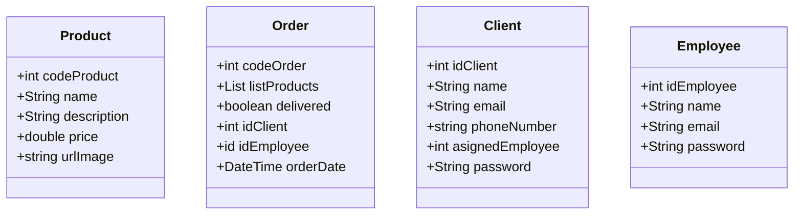
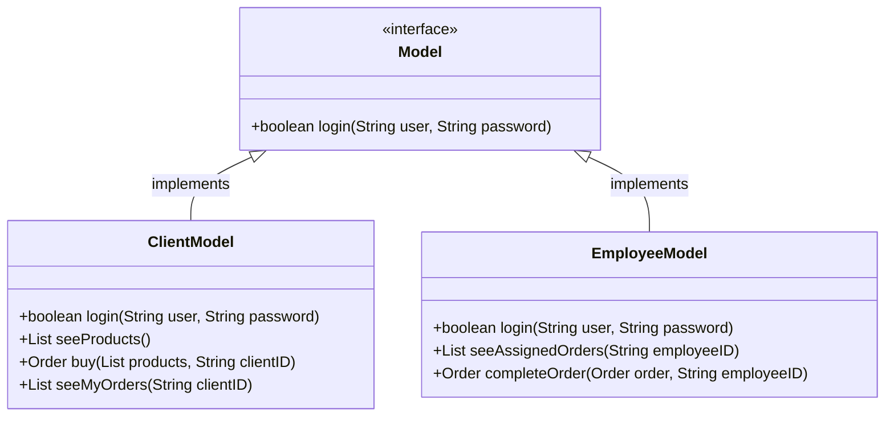

# Model design
## Classes

```mermaid
classDiagram
    class Product {
        +int codeProduct
        +String name
        +String description
        +double price
        +string urlImage
    }

    class Order {
        +int codeOrder
        +List<Product> listProducts
        +boolean delivered
        +int idClient
        +id idEmployee
        +DateTime orderDate
    }

    class Client {
        +int idClient
        +String name
        +String email
        +string phoneNumber
        +int asignedEmployee
        +String password
    }

    class Employee {
        +int idEmployee
        +String name
        +String email
        +String password
    }
```
## Model

```mermaid
classDiagram
    class Model {
        <<interface>>
        +boolean login(String user, String password)
    }

    class ClientModel {
        +boolean login(String user, String password)
        +List<Product> seeProducts()
        +Order buy(List<Product> products, String clientID)
        +List<Order> seeMyOrders(String clientID)
    }

    class EmployeeModel {
        +boolean login(String user, String password)
        +List<Order> seeAssignedOrders(String employeeID)
        +Order completeOrder(Order order, String employeeID)
    }

    Model <|-- ClientModel : implements
    Model <|-- EmployeeModel : implements

```
